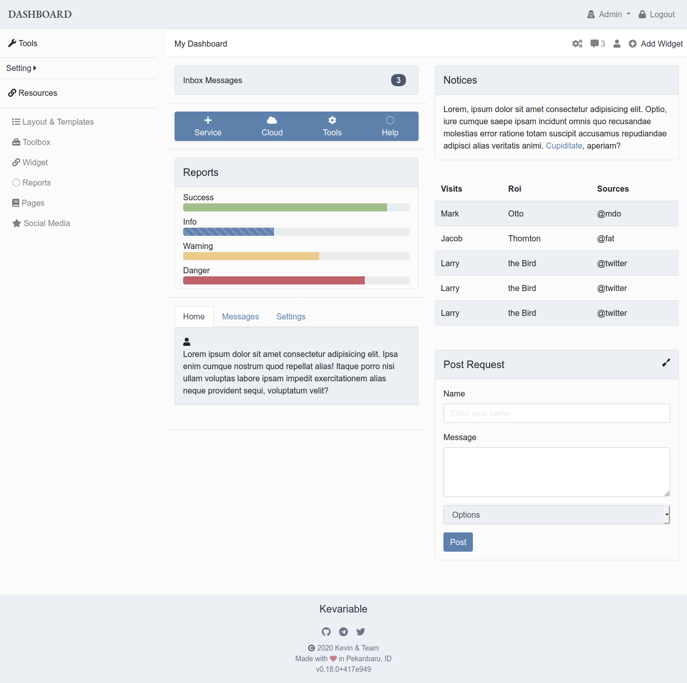

# Simple Dashboard

I have a practice from the campus, and I do this

## Getting Started

Make sure use the newest browser, I am not used babel or postcss

### Prerequisites

Node JS (`required`) here is [link](https://nodejs.org/en/)

### Installing

```shell
npm install
```

## Running the tests

```shell
npm run dev
```

and open in browser with `localhost:8080` instead

or open in `dist/` folder and open `index.html` instead

## License

This project is licensed under the MIT License - see the [LICENSE.md](LICENSE.md) file for details

## Acknowledgments

I thank my lecturer, because it made me grow

## Screenshot


